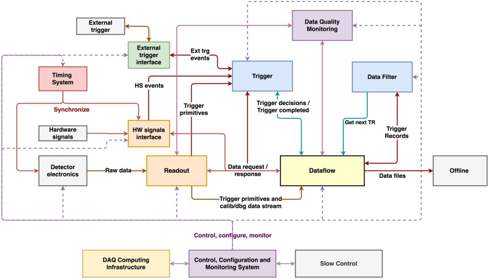
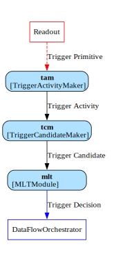
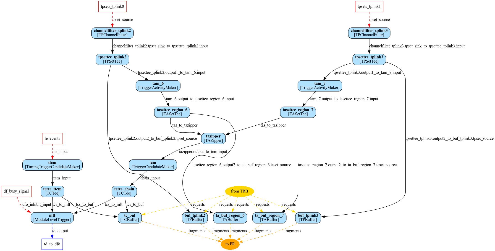

# Trigger

*(Last updated July 2023, MR)*

The `trigger` package contains the modules that make up the DUNE FD DAQ trigger system. Implementations of the physics algorithms that produce data selection objects (trigger activity and trigger candidates) live in the [`triggeralgs`](https://github.com/DUNE-DAQ/triggeralgs) package. Also, the scripts that generate the trigger application configuration lives in [`daqconf`](https://github.com/DUNE-DAQ/daqconf).
<hr>

<p>&nbsp; The main goal of the trigger is to extract information from data to form Trigger Decisions. Additionally, in conjunction with the Data Filter, the aim is to reduce the total data volume from the four planned DUNE modules to be in line with the DUNE requirements for trigger acceptance and efficiency for various physics signals.</p>

## Table of content

1. [Overview](#overview)
    1. [More details (of trigger functionality)](#more-details)
2. [Structure](#structure)
    1. [Terminology](#terminology)
        1. [Main objects](#main-objects)
        2. [Modules-Makers](#modules-makers)
        3. [Modules-Other](#modules-other)
3. [Flow](#flow)
    1. [Flow - detailed](#flow-detailed)
4. [Links to other repositories](#links-to-other-repositories)
    1. [Triggeralgs](#triggeralgs)
    2. [Trgdataformats](#trgdataformats)
    3. [Daqconf](#daqconf)
5. [Running](#running)
    1. [online](#online)
    2. [offline](#offline)
6. [Development](#development)
7. [Other](#other)


## Overview

### More details (of trigger functionality): <a name="more-details"></a>

* Identify clusters of Trigger Primitives indicating potentially interesting physics activity in a module.

* Handle multiple trigger sources, including TPC, PDS, calibration sources, beam information, and “external” information such as SNB notifications from adjacent DUNE modules or other experiments. Merging of readout windows for multiple coincident triggers, and explicit coincidence requirements (if desired) must be possible.

* Provide triggers such as random or pulsed triggers, and pre-scales of low-threshold or high-rate triggers

* Have a latency that is small compared to the resident time of data in the Readout buffers.

* Allow offline measurements of trigger efficiency and reconstruction of the decision path that went into generating a Trigger Records.

* Provide the ability to measure any trigger-related dead time, and provide operational monitoring information about rates of different trigger types.

* To not rely on external inputs (but these are supported (eg calibration)).

<p>All in all, the trigger is not just about selecting data, but rather selecting data “live”, i.e. taking decisions continuously, within an agreed latency and with limited computing resources compared to what can be done offline.</p>

Trigger's position relative to DAQ:
<p align="center">
  
</p>
<p> As can be seen, the trigger lies in the heart of DUNE DAQ, receiving multiple inputs, creating and forwarding trigger decisions, while also responding to data requests.</p>

## Structure

The trigger is designed hierarchically. The minimal (extremely simplified) flow:

<p align="center">
  
</p>

<p>&nbsp; The channel-level information in the form of Trigger Primitives is merged locally (at the scale of one TDAQ unit, such as an APA or CRP) into a cluster representing some type of Trigger Activity. Multiple Trigger Activity outputs can then be merged into a single Trigger Candidate that may include information spanning multiple TDAQ units or multiple slices of time (say, many APAs or many seconds) for a single system. Finally, multiple Trigger Candidates can be merged across systems (e.g. TPC and PDS) in the MLT.</p>

### Terminology:
#### Main objects:
* **Trigger Primitive (TP)**: The Simplest signal waveform representation (wire hit). These are generated using hit finding algorithms in readout.
* **Trigger Activity (TA)**: Cluster of hit(s) (TP(s)) that have been deemed fit to send up to the next level in the trigger hierarchy. Typically these will be tracks/showers or other outstanding physics activity within the box (subdetector).
* **Trigger Candidate (TC)**: Cluster of TAs across all sub-detectors.
* **Trigger Decision (TD)**: A trigger request issued by Module Level Trigger (MLT) to the Data Flow Orchestrator (DFO) in order to request the raw data of the relevant detector channels over specified time windows from the readout subsystem that should be permananently stored for later analysis.
* **Trigger Record (TR)**: An object in a stored file, containing the raw data, TPs, TAs and TCs that have led to it’s construction.

#### Modules-Makers:
* **Trigger Activity Maker (TAM)**: A general module in charge of processing the incoming stream of TPs
and issuing a localised activity trigger at the granularity of single APA/CRPs (and PDS detector units in the future). TAM have with them associated an algorithm, which attempts to search the incoming TP stream for interesting physics activity. The TAs that the TAM produces are sent to the TCM.
* **Trigger Candidate Maker (TCM)**: In analogy to the TAM, which identifies clusters of TPs representing activity across many wire channels, the TCM identifies clusters of TAs across many APAs/CRPs. As an example, consider a cathode crossing muon in ProtoDUNE, that generates a track on two opposite facing APAs. Should we want to trigger on this, the TCM might wait for the two corresponding tracks on the opposite APAs before issuing a TC to the Module Level Trigger.
* **Module Level Trigger (MLT)**: What you might imagine to be called the “TDMaker” at this point, is in fact the ‘edge’ of the trigger system, and we call it the Module Level Trigger. As it's name suggests, it is in charge of sending TDs to dataflow orchestrator for raw data contained within an entire DUNE FD module.

#### Modules-Other:
* **TPChannelFilter**: Filters out collection or induction *TPs* from its input *TPSets* and passes them on. One can filter out *TPs* based on their offline channel number. Useful for testing on the VDCB, where one might want to only present collection *TPs* to the **TAM** when searching for tracks. It can also filter out noisy channels.
* **Zipper**: A general module in charge of combining inputs from multiple streams and outputting them - time ordered - in a single queue to the following module (these require time ordered objects). ‘Late’ TPs are deemed ‘tardy’ according to their timestamps and dropped, since it is impossible to maintain time ordering when TPs of a earlier timestamp than those that have already been sent arrive at the zipper.
* **Tee**: DUNE DAQ has no inbuilt functionality for making copies of objects, so this module is a workaround for that. Each copy can be sent to a different module onward. 
* **Buffer**: We generally want to store the TPs, TAs, and TCs that led to stored Trigger Records (TRs) inside those TRs. The buffers service this ambition. We have TPBuffers, TABuffers and TCBuffers. They receive directly from the relevant Tee modules, as described above. Data requests are made to these buffers when a trigger decision is made (as well as to the raw data buffers in readout).

## Flow
A more realistic (still simplified) flow through the trigger application:
<p align="center">
  
</p>

<p>&nbsp; The diagram above shows the <b>DAQModules</b> and connections in an example trigger app. Rectangles are <b>DAQModules</b> in the app, while ellipses are externals inputs/outputs. Each <b>DAQModule</b> is labelled by its plugin type, and edges show the <i>type of data</i> that flows along the corresponding queue. There are two main sets of inputs: <i>trigger primitives</i> - packaged as <i>TPSets</i> - from readout, seen at the top of the image; and <i>HSI events</i> from the hardware signals interface, seen towards the bottom. Eventually, each of these inputs are processed into <i>Trigger Candidates</i> (<i>TCs</i>), which are fed to the <b>Module Level Trigger</b>, which issues trigger requests to the data flow orchestrator.</p>

### Flow - detailed:
Following one *TPSet* stream from upstream to downstream:

* The first module is the **TPChannelFilter**, which filters out collection or induction *TPs* from its input *TPSets* and passes them on. There is always one **TPChannelFilter** per sub-detector (there can, of course, be multiple sub-detectors - think APAs).
* Next we need to send the *TPSets* downstream to two different places. Firstly, to the **activity makers** (sometimes called **algorithms**) that will make trigger activities (*TAs*), and secondly to the **buffer** that holds *TPs* to be sent as a *fragment* in response to a *data request* from the *data flow* subsystem. Unfortunately the DAQ framework doesn’t provide a facility to do this copy, so we have to do it ourselves via the **TPSetTee module** (which is a template specialization of the **Tee<T\>** class).
* Following that is the **Trigger Activity Maker** (a specialization of the **Trigger Generic Maker** class) which handles passing the *TPs* from the *TPSets* to a (configurable) **algorithm** that makes *TAs* out of them, if conditions are met. The algorithm implements a function that takes a single *Trigger Primitive* and adds any *TAs* created at that step into an output vector. **TAM** guarantees that calls to the algorithm present the *Trigger Primitives* in time order (by start time). To achieve this, the **TAM** buffers its inputs until it knows it has got all of the *TPSets* for time T that it will get, then sorts the *TPs* from those *TPSets* before passing them to the **TAM algorithm**. The algorithm is not required to produce its outputs in any particular order; instead the **TAM** buffers the outputs from the algorithm and sends them out in order. If the algorithm outputs a *TA* with timestamp less than the last timestamp sent out by the **TAM**, that output is deemed tardy and dropped with a warning message. Each **TAM** sees the *TPs* from one APA.
* Next in the chain is the **TASetTee** - which is analogous to **TPSetTee** - with the only difference being that it works with *TAs* instead of *TPSets*. The **TAZipper** module zips data (think merging) across all sub-detectors. It takes multiple input streams of *TAs* - each of which is time-ordered - buffers them, and outputs them in time-order. This is a non-trivial operation because the different streams might not be exactly synchronized due to network or processing delays upstream. The **zipper** has a configurable timeout after which it will send *TAs* downstream even if it hasn’t seen a *TA* from every stream. After this, it’s possible for the zipper to move on and continue emitting *TAs* with later times. If a new input arrives with timestamp earlier than the latest sent time, it’s impossible to send that input while maintaining time-ordering of the output. The input is deemed “tardy” and it’s dropped with a warning message.
* The **TASetTee** and **Trigger Candidate Maker** are analogous to the **TPSetTee** and **TriggerActivityMaker** respectively, just with *TASets* as inputs. Thanks to the **TAZipper** upstream, the **Trigger Candidate Maker** is able to operate with activities from different sub-detectors (think APAs).
* The *TCs* made by the **TCM** are sent to the **Module Level Trigger**, which is responsible for sending the final *Trigger Decision* to the data flow subsystem (specifically to the **data flow orchestrator**). In addition to the *TCs* formed from *TAs/TPs*, there is an input stream to the **MLT** from the hardware signals interface (*HSI*). The stream sent to the trigger subsystem from the **HSI** consists of *HSIEvents*. These enter the **Timing Trigger Candidate Maker**. This module converts *HSIEvents* to *TCs* which are passed to the **MLT**.
* **TPBuffer**, **TABuffer** and **TCBuffer** (collectively, **TXBuffer**) buffer *TPs*/*TAs*/*TCs* and respond to *data requests* from the dataflow system. This means that the offline data file contains the *TPs*/*TAs*/*TCs* that were created in some time window around the trigger timestamp. The **TXBuffer** classes are plugins in the trigger package, but the real work is done by code borrowed from readoutlibs, in order to share the implementation of buffering and responding to data requests.
* The **Module Level Trigger** takes *TCs* from one or more streams and uses them to construct *trigger decisions* (*TDs*) that are sent to the dataflow subsystem. In the simplest case, the **MLT** just makes one *TD* for each *TC* it receives. However, **MLT** is capable of merging **TCs** whose readout windows overlap (defined by start and end times of the incoming *TCs*), and also has the option to trigger on coincidence(s) of selected TCs. The **MLT** can be in paused, inhibited, or enabled state. “Paused” means a human has paused triggers for some reason (likely at a test beam, unlikely in DUNE FD), while “inhibited” means the *data flow subsystem* has indicated that it can’t receive any more triggers (presumably because it can’t keep up with the trigger rate, although that’s not assumed anywhere in the MLT). In both these cases, no *trigger decisions* are sent to the **DFO**.

<p>&nbsp; It's important to keep in mind that the set-up (configuration) can vary widely. We can have one or <i>multiple subdetectors</i> (APAs / CRPs) <b>AND</b> we can have <i>multiple makers</i> (e.g. separate TAM for PDS and TPC systems).</p>

The general numbers are:

* **TPChannelFilter**: 1 per link (link here represents sub-detector (APA/CRP))
* **TPSetTee**: 1 per link
* **TriggerActivityMaker**: 1 (or more) per link
* **TASetTee**: 1 per TAM
* **TAZipper**: 1 (???)
* **TriggerCandidateMaker**: 1 (or more) per link 
* **TCTee**: 1 per TCM
* **TPBuffer**: 1 per TPSetTee
* **TABuffer**: 1 per TASetTee
* **TCBuffer**: 1 (???)
* **ModuleLevelTrigger**: 1 per application
* (optional)**TimmingTriggerCandidateMaker**: 1

## Links to other repositories

### Triggeralgs ([link](https://github.com/DUNE-DAQ/triggeralgs)) <a name="triggeralgs"></a>
The triggeralgs package contains implementations of the algorithms that produce TAs from TPs and TCs from TAs. The idea of keeping these in their own package (instead of trigger) is to allow the algorithms to be used in the offline software to simulate the effect of the trigger system, where probably the only things they care about are efficiency at very low energies and whatever we do about not reading out the whole detector for every event, which will certainly involve not reading out all APAs/CRPs, and may also include more aggressive ROI finding. Keeping triggeralgs separate from trigger means that the former package doesn’t need to depend on anything from the DAQ software, and so could just be built as part of the offline software.
Loading triggeralgs algorithms dynamically as plugins in the DAQ is done in a complicated way: triggeralgs doesn’t depend on any plugin library, so instead we manually make plugins in the trigger package for each of the algorithms in triggeralgs, like this:
[TriggerActivityMakerPrescalePlugin.cpp](https://github.com/DUNE-DAQ/trigger/blob/develop/plugins/TriggerActivityMakerPrescalePlugin.cpp).


### Trgdataformats ([link](https://github.com/DUNE-DAQ/trgdataformats)) <a name="trgdataformats"></a>
The approach used by DUNE DAQ for saving fragments to disk is designed for raw data that comes off of hardware, which is always a stream of contiguous bytes, with a well-defined meaning for each byte. The objects in the trigger system, on the other hand, are defined as C++ structures, which could potentially be expressed in different ways in memory (eg on big-endian or little-endian systems), and are not in general contiguous (they might have pointers to data on the heap, as when you have a std::vector member). What this means for the trigger is that if we want to store trigger primitives/activities/candidates in fragments (for debugging, for understanding the trigger system, for passing to the data filter, or  for offline analysis), we have to make a representation of the class that is contiguous in memory, with data at specified byte positions. This happens in trgdataformats using overlays, explained here: [trigger data objects](https://github.com/DUNE-DAQ/trgdataformats/tree/develop/include/trgdataformats).

### Daqconf ([link](https://github.com/DUNE-DAQ/daqconf)) <a name="daqconf"></a>
The daqconf repository contains tools for generating DAQ system configurations. It generates DAQ system configurations with different characteristics based on the configuration file and command-line parameters given to it. This includes configuration for the trigger application. So every input that needs to be configurable is handled here and passed to the trigger app. Additionally, the links (input/output connections between modules) are also defined here.

## Running
### online
The instructions for running with real hardware change often. Please follow:

* Trigger system introduction document: [DocDB #28497](https://docs.dunescience.org/cgi-bin/private/ShowDocument?docid=28497) (also contains many useful links!)
* Run control (CERN): [link](https://twiki.cern.ch/twiki/bin/view/CENF/NanorcRunControl)
* DUNE DAQ Prototype (CERN): [link](https://twiki.cern.ch/twiki/bin/view/CENF/DUNEDAQProto)

### offline
Trigger replay app [replay_tp_to_chain](python/trigger/replay_tp_to_chain): A tool for running the trigger application in isolation from the rest of the DUNE DAQ apps. It accepts input file(s) that are simple `.txt`, containing TPs; and runs your configured algorithm over them. These could be real streamed TPs (from the cold-box for example) or simulated ones (LArSoft).

* `python -m trigger.replay_tp_to_chain`: runs the configuration generation code. 
* `-s X` slows down the input by a factor *X* (by decreasing the clock rate by that factor) which is useful when outputting large logs/debugging information for example. 
* `--trigger-activity-plugin` specifies the name of the TAM you would like to use. 
* Similarly `--trigger-candidate-plugin` identifies the TCM. 
* `--trigger-activity-config` provides a dictionary, which maps the configuration for your specified TAM, triggering thresholds etc. This can be done for the TCM too.
* `-l` specifies the number of times you would like to play the data file through the system. 
* Finally, `--input-file` points to your input file of TPs, which have the standard format: 
<table>
  <tr>
    <th> time start </th> 
    <th> time over threshold </th> 
    <th> time peak </th> 
    <th> channel </th> 
    <th> adc integral </th> 
    <th> adc peak </th> 
    <th> det id </th> 
    <th> type </th>
  </tr>
</table> 

Few example files are available at `/nfs/rscratch/trigger/tp_files` at CERN:

* *1000_electron_events.txt*: simulated electron events
* *tp_dataset_run020472_2s.txt*: real TPs taken from March 2023 Vertical Drift ColdBox, 2 seconds
* *tp_dataset_run020472_60s.txt*: real TPs taken from March 2023 Vertical Drift ColdBox, 60 seconds
* *pds_tps_60s.txt*: real TPs from the PDS system

Example command:
```
python -m trigger.replay_tp_to_chain -s 10 --trigger-activity-plugin TriggerActivityMakerHorizontalMuonPlugin --trigger-activity-config ‘dict(adjacency_threshold=100, window_length=10000, adj_tolerance=20)‘ --trigger-candidate-plugin TriggerCandidateMakerHorizontalMuonPlugin --trigger-activity-config ‘dict(adjacency_threshold=100, window_length=10000, adj_tolerance=20)‘ -l 1 --input-file $TPDATA/tp_dataset_run020472_2s.txt json
```

## Development
* [Development workflow](https://dune-daq-sw.readthedocs.io/en/latest/packages/daq-release/development_workflow_gitflow/)
* [Setting up DUNE DAQ development area](https://github.com/DUNE-DAQ/daqconf/wiki/Instructions-for-setting-up-a-development-software-area)
* [Writing trigger algorithm](https://dune-daq-sw.readthedocs.io/en/latest/packages/trigger/trigger-alg-howto/)
* [DAQ buildtools](https://dune-daq-sw.readthedocs.io/en/latest/packages/daq-buildtools/)
* [Coding styleguide](https://dune-daq-sw.readthedocs.io/en/latest/packages/styleguide/)

For trigger code development, please:

* **Follow the styleguide** linked above.
* **Never push directly to the `develop` branch**. Create a branch (name should contain an easily recognisable name and reflect the purpose of the feature/fix, e.g. `name/new_feature`.) and make a **pull request** to the appropriate branch. At least one reviewer is required (more for big changes). Genera rule of thumb: don't merge your own PR.
* **Always use integration tests.** A selection is available at [dfmodules integration tests](https://github.com/DUNE-DAQ/dfmodules/tree/develop/integtest). As a minimum, the `minimal_system_test`, `fake_data_producer` and `3ru_3df_multirun` tests should be run (the more the better of course). Some tests require more powerful machines (available at np04).
* No `warnings` when building.
* *clang formatting*: there is an inbuilt script available (from dbt) to apply Clang-Format code style: `dbt-clang-format.sh`. Run without arguments for usage information.


## Other
