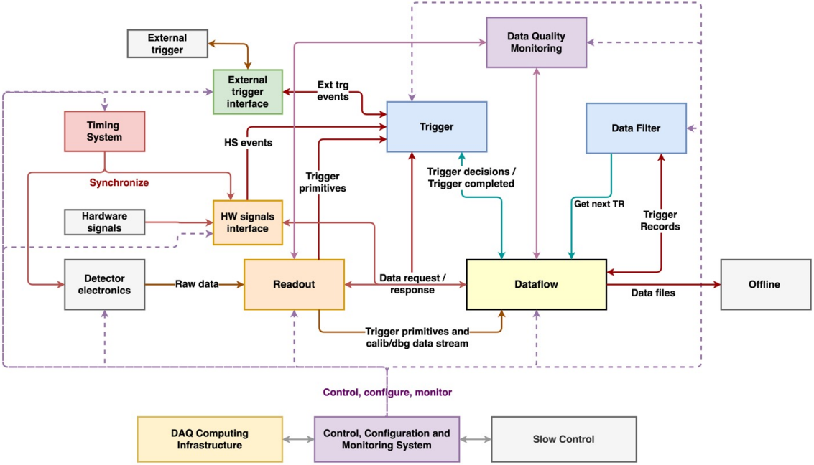
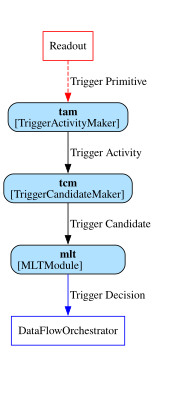
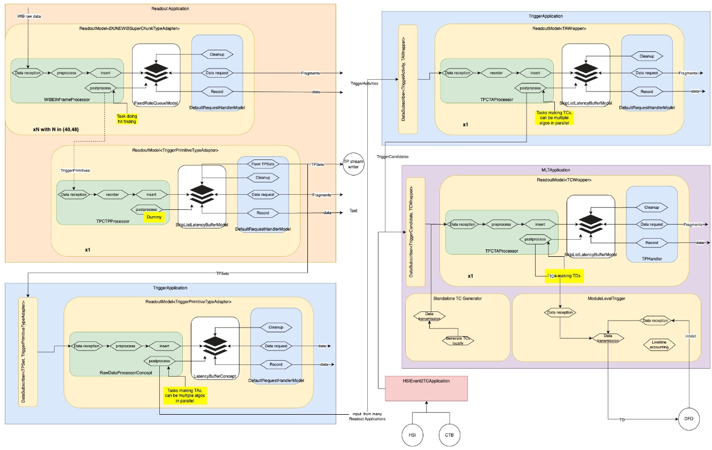

# Trigger

*(Last updated July 2023, MiR + AS)*

The `trigger` package contains the modules that make up the DUNE FD DAQ trigger system. Implementations of the physics algorithms that produce data selection objects (trigger primitive, trigger activity and trigger candidates) live in the [`tpglibs`](https://github.com/DUNE-DAQ/tpglibs) and [`triggeralgs`](https://github.com/DUNE-DAQ/triggeralgs) packages. The configuration schema & code that generates trigger application live in [`appmodel`](https://github.com/DUNE-DAQ/appmodel)

The main goal of the trigger is to extract information from data to form Trigger Decisions, which make the requests to save the raw data. Additionally, in conjunction with the DataFilter, [`datafilter`](https://github.com/DUNE-DAQ/datafilter), the aim is to reduce the total data volume from the four planned DUNE modules to be in line with the DUNE requirements for trigger acceptance and efficiency for various physics signals.

## Table of content

1. [Overview](#overview)
    1. [More details (of trigger functionality)](#more-details)
2. [Structure](#structure)
    1. [Terminology](#terminology)
        1. [Main objects](#main-objects)
        2. [Modules-Makers](#modules-makers)
        3. [Modules-Other](#modules-other)
3. [Flow](#flow)
    1. [Flow - detailed](#flow-detailed)
4. [Links to other repositories](#links-to-other-repositories)
    1. [Triggeralgs](#triggeralgs)
    2. [Trgdataformats](#trgdataformats)
    3. [Daqconf](#daqconf)
5. [Running](#running)
    1. [online](#online)
    2. [offline](#offline)
6. [Development](#development)
7. [Other](#other)

## Overview

### More details (of trigger functionality): 

* Self-triggering: Identify high electronic signals indicating interesting physics activity in a channel and store it as a Trigger Primitive (TPG algorithms). Identify clusters of hits in a module (Trigger Activity), and merge clusters across modules (Trigger Candidate).

* Handle multiple trigger sources, including TPC, PDS, calibration sources, beam information, and “external” information such as SNB notifications from adjacent DUNE modules or other experiments. Merging of readout windows for multiple coincident triggers, and explicit coincidence requirements (if desired) must be possible.

* Provide triggers such as random or pulsed triggers, and support pre-scaling of all triggers (e.g. for low-threshold or high-rate triggers).

* Have a latency that is small compared to the resident time of data in the Readout buffers.

* Allow offline measurements of trigger efficiency and reconstruction of the decision path that went into generating a Trigger Record.

* Provide the ability to measure any trigger-related dead time, and provide operational monitoring information about rates of different trigger types.

Trigger's position relative to DAQ:

  

 As can be seen, the trigger lies in the heart of DUNE DAQ, receiving multiple inputs, creating and forwarding trigger decisions, while also responding to data requests.

## Structure

The trigger is designed hierarchically. The minimal (extremely simplified) flow:

  

The hits-on-wire, in the form of Trigger Primitives, are merged at the scale of one TDAQ unit (such as an APA or CRP) into a cluster representing some type of Trigger Activity. Multiple Trigger Activity outputs can then be merged into a single Trigger Candidate that may include information spanning multiple TDAQ units or multiple slices of time (say, many APAs or many seconds) for a single system. Finally, multiple Trigger Candidates can be merged across systems (e.g. TPC and PDS) in the MLT into a Trigger Decision, a request to save the data.

### Terminology:
#### Main objects:
* **Trigger Primitive (TP)**: The Simplest signal waveform representation (wire hit). These are generated using hit finding algorithms in the readout subsystem.
* **Trigger Activity (TA)**: Cluster of hit(s) (TP(s)) that have been deemed fit to be sent up to the next level in the trigger hierarchy. Typically these will be tracks/showers or other outstanding physics activity within the box (sub-detector).
* **Trigger Candidate (TC)**: Cluster of TAs across all sub-detectors.
* **Trigger Decision (TD)**: A trigger request issued by Module Level Trigger (MLT) to the Data Flow Orchestrator (DFO) in order to request the raw data of the relevant detector channels over specified time windows from the readout subsystem that should be permanently stored for later analysis.
* **Trigger Record (TR)**: An object in a stored file, containing the raw data, TPs, TAs, and TCs that have led to its construction.

#### Modules-Makers:
* **Trigger Primitive Generator (TPG)**: An algorithm that sees the continous waveform on a channel, and detects "hits", generating Trigger Primitive (TP) object.
* **Trigger Activity Maker (TAM)**: A module processing the incoming stream of TPs and finding localised activity at the granularity of single APA/CRPs (and PDS detector units in the future). TAMs have associated algorithms that define the search for activity (e.g. based on clustering). The TAs that a TAM produces are sent to the TCM.
* **Trigger Candidate Maker (TCM)**: A module that identifies clusters of TAs across many APAs/CRPs, e.g. a cathode crossing muon in ProtoDUNE, with a track on two opposite facing APAs. As with TAMs, TCMs have associated algorithms with the TA-merging logic.
* **Module Level Trigger (MLT)**: A module that handles TCs and produces data readout signals (Trigger Decisions) based on those. This may include merging overlapping events, deciding on the readout windows, ROI (in the future) etc.

#### Modules-Other:
* **TriggerDataHandlerModule**: The trigger objects are contained inside independent "DataHandler" units. Each unit receives some type of data (e.g. TriggerPrimitive), can run pre-processing task on that data, places it into a buffer, and runs post-processing task after retreival from that buffer. The post-processing (e.g. TriggerActivityMaker) task usually generates different data-type, e.g. TriggerActivity. The TriggerDataHandlerModule also contains a LatencyBufferHandler, which deals with buffer cleanup, readout requests etc.

## Flow
There currently does not exist an up-to-date representation of the trigger system, but from the beginning of the v5 development:

  

The diagram above shows the **DAQModules** and connections in an example trigger and readout app. Blue rounded rectangles are the **TriggerDataHandler** **DAQModules**, red rectangles are the external trigger inputs, the orange rectangle represents the readout application, and the purple represents the **ModuleLevelTrigger**, handling the trigger candidates. Each **DataHandler** module (here called **ReadoutModel**) receives one type of data (e.g. TriggerActivity), runs pre-processing tasks on it, inserts it into a latency buffer (that is handled by the LatencyBufferHandler), and runs post-processing tasks generating a new object (e.g. TriggerCandidate).

## Links to other repositories

### tpglibs ([link](https://github.com/DUNE-DAQ/tpglibs)) 
Repository that holds the algorithms that generate the TriggerPrimitives out of the continously-supplied waveforms, from each channel. It is used by the readout application, and includes both the native and AVX implementations of the TPG algorithms.

### triggeralgs ([link](https://github.com/DUNE-DAQ/triggeralgs)) 
The triggeralgs package contains implementations of the algorithms that produce TAs from TPs and TCs from TAs. They are in a separate package to allow the algorithms to be built outside of the DAQ software stack and used in the offline software, enabling a completely-independent development of the trigger algorithms. Trigger algorithms are easliely loaded dynamically only knowing their name, through a factory method: [AlgorithmPlugins.hpp](https://github.com/DUNE-DAQ/trigger/blob/develop/include/trigger/AlgorithmPlugins.hpp).

### trgdataformats ([link](https://github.com/DUNE-DAQ/trgdataformats)) 
The trigger data objects are defined as C++ structures, which could potentially be expressed in different ways in memory (eg on big-endian or little-endian systems), and do not have to be contiguous in memory.
The trgdataformats repository contains the C++ structures that hold the trigger data formats, and various overlays that extend the trigger objects to be continous in memory to allow them to be stored in the buffers and saved as fragments.

### appmodel ([link](https://github.com/DUNE-DAQ/appmodel)) 
The appmodel repository contains the configuration schema for all the trigger (an more) objects, together with functions that generate the trigger application out the xml data that follows those schemas. This includes configuration of the trigger algorithms, setup of the external triggers, creating queues between different `DAQModules` etc.

## Running
### online
The instructions for running with real hardware change often. Please follow:

* Trigger system introduction document: [DocDB #28497](https://docs.dunescience.org/cgi-bin/private/ShowDocument?docid=28497) (also contains many useful links!)
* Run control (CERN): [link](https://twiki.cern.ch/twiki/bin/view/CENF/NanorcRunControl)
* DUNE DAQ Prototype (CERN): [link](https://twiki.cern.ch/twiki/bin/view/CENF/DUNEDAQProto)
* Daqconf wiki: [link](https://github.com/DUNE-DAQ/daqconf/wiki)

### offline
**Offline live emulation currently not supported in v5**

## Development
* [Development workflow](https://dune-daq-sw.readthedocs.io/en/latest/packages/daq-release/development_workflow_gitflow/)
* [Setting up DUNE DAQ development area (v5.3)](https://github.com/DUNE-DAQ/daqconf/wiki/Setting-up-a-fddaq%E2%80%90v5.3.0-development-area)
* [Writing trigger algorithm](https://dune-daq-sw.readthedocs.io/en/latest/packages/trigger/trigger-alg-howto/)
* [DAQ buildtools](https://dune-daq-sw.readthedocs.io/en/latest/packages/daq-buildtools/)
* [Coding styleguide](https://dune-daq-sw.readthedocs.io/en/latest/packages/styleguide/)

For trigger code development, please:

* **Follow the styleguide** linked above.
* **Never push directly to the `develop` branch**. Create a branch (name should contain an easily recognisable name and reflect the purpose of the feature/fix, e.g. `name/new_feature`.) and make a **pull request** to the appropriate branch. At least one reviewer is required (more for big changes). General rule of thumb: don't merge your own PR.
* **Always use integration tests.** A selection is available at [daq-systemtest integration tests](https://github.com/DUNE-DAQ/daqsystemtest/tree/develop/integtest). As a minimum, the `minimal_system_quick_test`, `fake_data_producer_test` and `3ru_3df_multirun_test` tests should be run (the more the better of course). Some tests require more powerful machines (available at np04).
* No `warnings` when building.
* *clang formatting*: there is an inbuilt script available (from dbt) to apply Clang-Format code style: `dbt-clang-format.sh`. Run without arguments for usage information.

## Other
